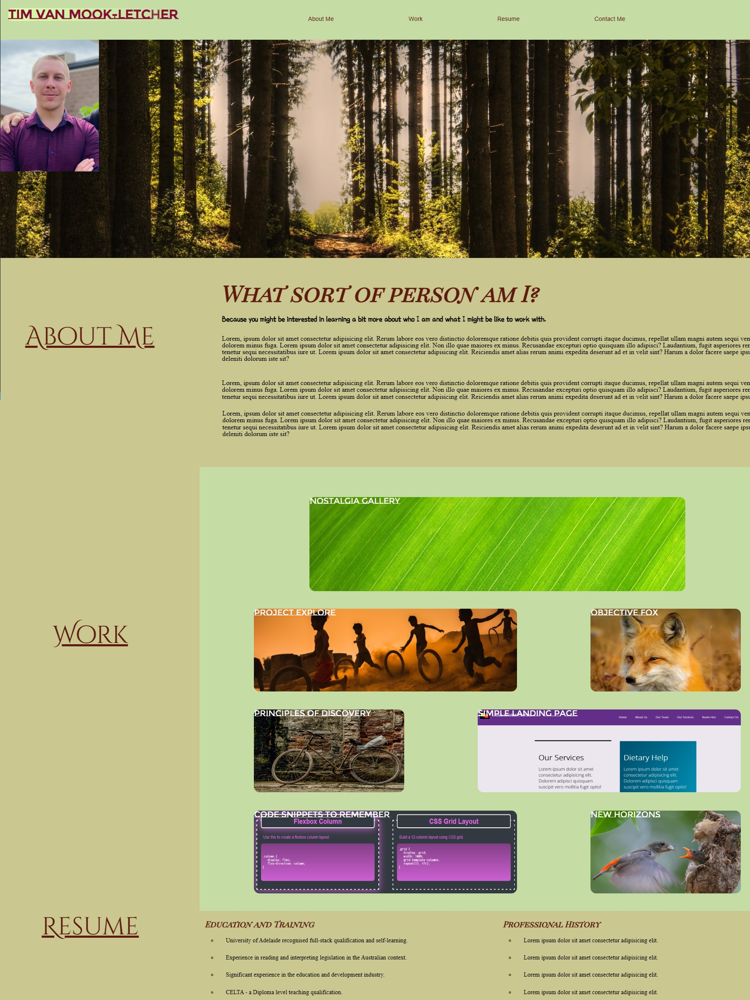

# portfolio-showcase

## Description

The motivation behind this project was to practice and clarify concepts and understanding related to more advanced techniques in CSS by creating a portfolio page that showcases my ability to apply concepts I have learnt. Specifically, this portfolio's construction allowed me to practice the use of flexbox, pseudo-classes and elements, media-queries and responsiveness as well as other techniques of lesser importance such as embedding fonts. The construction here forced me to rethink many of the things that I thought I knew about page design and the use of display and positioning techniques. The next time I build a project like this it will have a for more intuitive layout and will be designed initially with that in mind to save time on media queries and problem solving.

## Table of Contents

- [Description](#description)
- [Usage](#usage)
- [Credits](#credits)
- [License](#license)

## Installation

N/A

## Usage

This website shows some basic information about myself as well as some placeholder content that are designed to eventually be replaced when I have the completed projects under my belt in order to do so. 
The links in the navigation bar at the top will take the user to the appropriate part of the page. Some of the cards in the work section will lead to a deployed miniproject from the course. More projects and applications will be added as soon as we get to them in class.

Screenshot:

## Credits

Everything is my own work, but credit to my teachers for giving me the tools to make it.

## License

Licensed under the MIT license.
